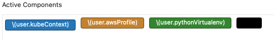

OS X dotfiles
========
**Please note:** These dotfiles contain many tools specific to Python development

Install Xcode command line tools:

    xcode-select --install

Clone repo into home directory:

    git clone https://github.com/colinhoglund/dotfiles.git
    cd dotfiles

Deactivate any existing python virtualenvs and run installers:

    dotfiles -c config.yaml
    eval $(/opt/homebrew/bin/brew shellenv)
    brew bundle
    ~/.install.sh
    make all
    . ~/.bash_profile

Optional Steps:
- Load custom iTerm2 preferences:
  - `cp com.googlecode.iterm2.plist ~/`
  - Settings -> General -> Settings -> Load preferences from a custom folder or URL -> enter `~/`
- Enable iterm2 [status bar](https://iterm2.com/documentation-status-bar.html)
  - Settings -> Profiles -> Default -> Session -> Enable "Status bar enabled"
  - Click "Configure Status Bar" to configure variables set in .bash_profile
  - Example configuration

    
